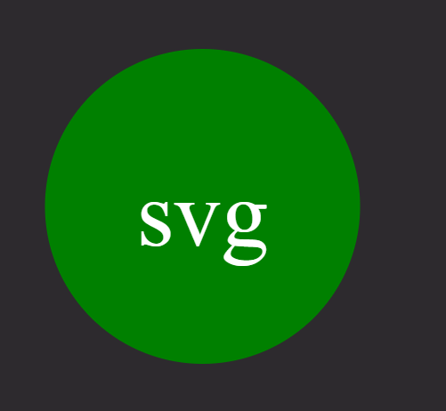

# SVG-Logo-Maker

[](https://opensource.org/licenses/MIT)

This is a JavaScript program that generates SVG (Scalable Vector Graphics) files based on user input. The program allows the user to create an SVG image with text and shapes.

## Features

- User input: The program prompts the user to enter up to three characters, choose a text color, choose a shape color, and select a shape from the available options (circle, square, or triangle).
- SVG generation: The program generates an SVG image with the specified text and shape, applying the chosen colors.
- File output: The generated SVG image is saved to a file named `logo.svg`.



## Installation

To run the SVG Shape Generator, follow these steps:

1. Ensure that you have [Node.js](https://nodejs.org) installed on your system.
2. Clone or download this repository to your local machine.
3. Open a terminal or command prompt and navigate to the project directory.
4. Run the following command to install the required dependencies:

```
    npm install
```


## Usage

1. In a terminal or command prompt, navigate to the project directory.
2. Run the following command to start the program:

```
    node index.js
```

3. Follow the prompts to enter the desired text, text color, shape color, and shape selection.
4. After providing the input, the program will generate the SVG image and save it to a file named `logo.svg` in the project directory.

you can find a link to the video [here](https://drive.google.com/file/d/1L3Q_a9A7-DzH17MTnZSAC21_V46DGiAK/view)

## Testing

The program includes automated tests to ensure the correctness of the shape rendering functionality.

To run the tests, use the following command:

```
    npm test
```


The test suite includes separate test cases for each shape (Circle, Square, and Triangle). It checks if the rendered SVG output matches the expected output based on the chosen color.


## Dependencies

The program utilizes the following dependencies:

- [Node.js](https://nodejs.org) - JavaScript runtime environment.
- [fs](https://nodejs.org/api/fs.html) - Node.js module for file system operations.
- [inquirer](https://www.npmjs.com/package/inquirer) - Interactive command-line user interface library for Node.js.
- [jest](https://www.npmjs.com/package/jest) - Node.js library for a suite of unit tests.

## Contact

Feel free to follow me [Github](https://github.com/brendan-aper)
You can also view the Repo for this project [here](https://github.com/brendan-aper/SVG-Logo-Maker)

If you have any questions, feel free to [email me](mailto:brendanaper@gmail.com).


## License

This project is licensed under the [MIT License](LICENSE).


